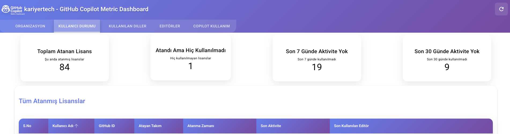

# GitHub Copilot Metrics Dashboard

<p align="center">
  
 />
</p>

## İçindekiler
- [Türkçe](#türkçe)
- [English](#english)
- [Lisans / License](#lisans--license)

---

## Türkçe

### Genel Bakış
GitHub Copilot Metrics Dashboard, GitHub Copilot kullanımı için içgörüler ve analitikler sağlayan bir web uygulamasıdır. Ekiplerin Copilot kullanım modellerini, verimliliğini ve geliştirme iş akışlarına etkisini takip etmelerine ve analiz etmelerine yardımcı olur.

### Özellikler
- Gerçek zamanlı metrik görselleştirme
- Kullanım istatistikleri ve trendler
- Ekip performans analitiği
- Özelleştirilebilir paneller
- GitHub OAuth ile güvenli kimlik doğrulama

### Örnek Dashboard
<p align="center">
  
</p>

### Gereksinimler
- Node.js (v16 veya üzeri)
- npm veya yarn
- Copilot erişimi olan GitHub hesabı
- Docker ve Docker Compose (konteynerli dağıtım için)

### Kurulum

#### 1. Depoyu klonlayın
```bash
git clone https://github.com/kariyertech/GitHub-Copilot-Metric-Dashboard.git
cd github-copilot-metrics-dashboard
```

#### 2. Bağımlılıkları yükleyin
```bash
npm install
```

#### 3. Ortam değişkenlerini yapılandırın
Bir `.env` dosyası oluşturun ve şunları ekleyin:
```env
NUXT_GITHUB_TOKEN=github_tokeniniz
NUXT_SESSION_PASSWORD=oturum_sifreniz
NUXT_OAUTH_GITHUB_CLIENT_SECRET=github_client_secretiniz
```

#### 4. Geliştirme sunucusunu başlatın
```bash
npm run dev
```

### Docker Desteği

#### Docker Kullanımı
```bash
docker build -t copilot-metrics-dashboard .
docker run -p 3000:3000 copilot-metrics-dashboard
```

#### Docker Compose Kullanımı
1. Yukarıdaki gibi bir `.env` dosyası oluşturun.
2. Uygulamayı başlatın:
```bash
docker-compose up -d
```
3. Uygulamayı durdurmak için:
```bash
docker-compose down
```

---

## English

### Overview
GitHub Copilot Metrics Dashboard is a web application that provides insights and analytics for GitHub Copilot usage. It helps teams track and analyze their Copilot usage patterns, efficiency, and impact on development workflows.

### Features
- Real-time metrics visualization
- Usage statistics and trends
- Team performance analytics
- Customizable dashboards
- Secure authentication with GitHub OAuth

### Example Dashboard
<p align="center">
  

</p>

### Prerequisites
- Node.js (v16 or higher)
- npm or yarn
- GitHub account with Copilot access
- Docker and Docker Compose (for containerized deployment)

### Installation

#### 1. Clone the repository
```bash
git clone https://github.com/kariyertech/GitHub-Copilot-Metric-Dashboard.git
cd github-copilot-metrics-dashboard
```

#### 2. Install dependencies
```bash
npm install
```

#### 3. Configure environment variables
Create a `.env` file and add:
```env
NUXT_GITHUB_TOKEN=your_github_token
NUXT_SESSION_PASSWORD=your_session_password
NUXT_OAUTH_GITHUB_CLIENT_SECRET=your_github_client_secret
```

#### 4. Start the development server
```bash
npm run dev
```

### Docker Support

#### Using Docker
```bash
docker build -t copilot-metrics-dashboard .
docker run -p 3000:3000 copilot-metrics-dashboard
```

#### Using Docker Compose
1. Create a `.env` file as above.
2. Start the application:
```bash
docker-compose up -d
```
3. To stop the application:
```bash
docker-compose down
```

---

## Lisans / License

MIT License  
© 2025 Kariyer.net Tech & Innovation
